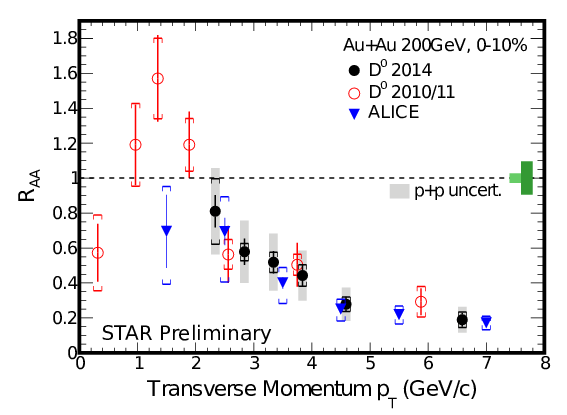
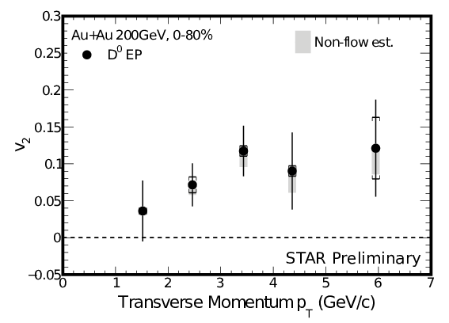
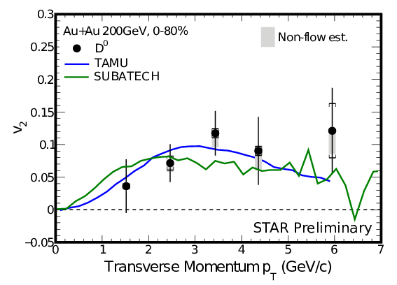

##D0 Azimuthal Anisotropy, Spectra and Nuclear Modification Factor
LBNL - STAR Experiment, Relativistic Heavy Ion Collider (RHIC), BNL  
RHIC year 2014 Run, with Heavy Flavor Tracker
  
- - -
### Conference Presentations:  
1. [RAA of D0 Meson in Au+Au Collisions at 200GeV](https://indico.cern.ch/event/355454/session/15/contribution/523/attachments/1160788/1671215/GuannanX_DMesonQM15_V0.11.pdf), Guannan Xie, QM15,2015-09-28  
2. [Measurement of D Meson Azimuthal Anisotropy in Au+Au Collisions at 200GeV](https://indico.cern.ch/event/355454/session/23/contribution/493/attachments/1161448/1672365/QM15DMesonv2.pdf), Michael Lomnitz, QM15,2015-09-29  
3. [Overview of recent results from the STAR experiment](https://indico.cern.ch/event/355454/session/45/contribution/60/attachments/1162854/1678473/2015-10-01-QM15-STAR-Overview-v5.pdf), Mustafa Mustafa, QM15,2015-10-01  
4. [Nuclear Modification Factor of D0 Meson in Au+Au Collisions at 200GeV](http://www.star.bnl.gov/protected/heavy/xgn1992/QM15/GuannanX_DMesonDNP_v2.pdf), Guannan Xie, DNP2015,2015-10-31  

### Seminars:
1. [Open heavy flavor measurements in Au+Au collisions at 200GeV using the STAR Heavy Flavor Tracker](https://drupal.star.bnl.gov/STAR/system/files/UICSeminar.pdf), Michael Lomnitz, UIC,2015-10-19  

- - -
### Preliminary results:

